# 黑马头条自媒体项目


# 课程介绍

## 做什么

> 一个类似于[今日头条自媒体头条号](<http://mp.toutiao.com/profile_v3/index>)的后台管理系统。


## 技术栈

- [Vue.js](<https://cn.vuejs.org/>)
- [Vue Router](<https://router.vuejs.org/>)
- [Vue CLI](<https://cli.vuejs.org/>)
- [Vuex](<https://vuex.vuejs.org/zh/>)
- [axios](<https://github.com/axios/axios>)
- [Element](<https://element.eleme.cn/#/zh-CN>)
- [Echarts](<https://echarts.baidu.com/>)
- [nprogress](<https://github.com/rstacruz/nprogress>)
- [Quill](<https://github.com/quilljs/quill>)
- ...


## 案例演示

在线地址：<http://ttmp.research.itcast.cn/>

> 账号：`13911111111`
>
> 密码：`246810`


## 课程目标

能使用  Vue + Element组件库  系列技术栈 进行后台管理系统开发。


## 相关资源

今日头条自媒体项目：[https://mp.toutiao.com](https://mp.toutiao.com/)

参考项目：http://ttmp.research.itcast.cn/

接口地址：http://ttapi.research.itcast.cn/mp/

PC端使用手机号登录前，必须先使用该手机号在移动端接口登录，注意下面这个接口跟上面不一样
http://ttapi.research.itcast.cn/app/v1_0/authorizations
账号可以是任意手机号，验证码是：246810


## 注册账号

[http://ttmp.research.itcast.cn](http://ttmp.research.itcast.cn/)是参考项目在线访问地址，为了区分，请使用自己的手机号码登录系统，登录前需要注册，具体步骤如下：

在你的 POSTMAN 接口测试工具中通过post方式请求如下地址：

接口地址：`http://ttapi.research.itcast.cn/app/v1_0/authorizations`

请求方法：`POST`

请求体：

```json
{
  "mobile": "你的手机号",
  "code": "246810"
}
```

登录即可完成注册。

然后你就可以使用  你的手机号 + `246810` 登录后台了。


测试账号：

- 手机号：`13911111111`
- 验证码：`246810`


# 起步


## VueCLI

### 什么是

Vue CLI 是 Vue 的**脚手架**工具，它可以帮助我们快速生成 Vue **项目基础**代码，提供开箱即用的功能特性，使得开发人员注意力集中在业务层面

[官网参考](https://cli.vuejs.org/zh/)


### 有什么好处

- 不必自己搭建项目主结构文件目录
- 不必自己安装项目通用功能模块(webpack/router/vue)
- 不必自己给webpack做主要配置和loader安装配置
- 使得开发人员的全部精力集中在业务层面上


### 安装

```
yarn add -g @vue/cli
```

使用 vue --version 查看vue脚手架版本并确认是否安装成功。

```
vue --version
```


运行以下命令来创建一个新项目

```
vue create my-project
```


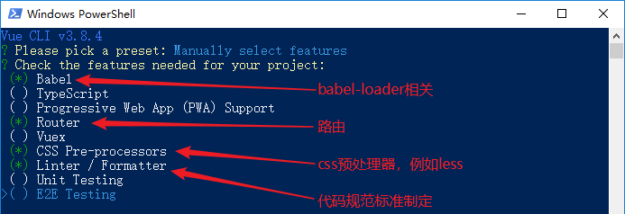


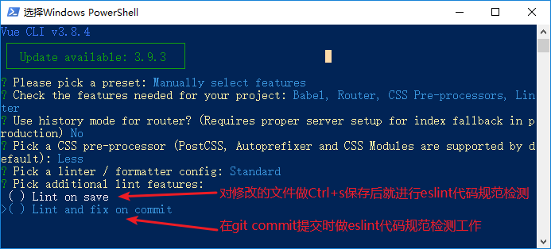

> 上图的两个项目都不要选取


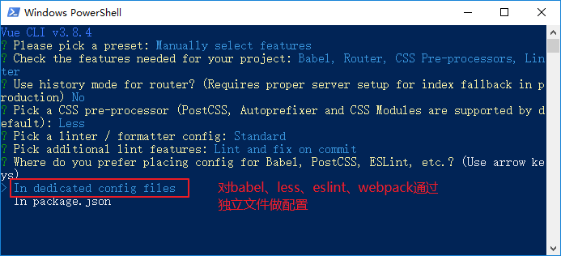


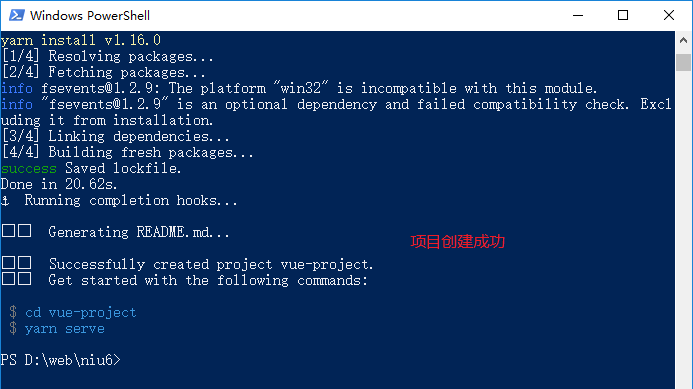


(题外话：当再次创建项目时，就可以选取之前配置好的项目，**一次性**完成项目的创建，不用再详细选取配置)


上边的20190628的配置在如下文件了(可以直接删除)：


创建好的项目效果


```javascript
|-- node_modules								// 项目需要的依赖包
|-- public										 // 静态资源存储目录
|   |-- index.html							// 项目主容器文件
|   |-- favicon.ico							// 项目默认索引图片
|-- src
|   |-- assets									// 放置一些静态资源文件，例如图片、图标、字体 
|   |-- components							// 公共组件目录
|   |-- views									  // 业务组件目录
|   |-- App.vue									// 顶层根基路由组件
|   |-- main.js									// 主入口文件
|   |-- router.js								// 路由配置文件
|-- .editorconfig								// 代码规范配置文件
|-- .eslintrc.js								// eslint代码规范检查配置文件
|-- .gitignore									// git上传需要忽略的文件格式
|-- babel.config.js							// babel配置文件
|-- package-lock.json						// 依赖包版本锁定文件
|-- package.json								// 项目基本信息配置文件
|-- postcss.config.js						// css预处理器配置文件
|-- vue.config.js								// webpack 配置文件(与webpack.config.js作用一致)
```


### 相关配置

#### 打包相关参数

在package.json中直接配置即可

实时打包运行

```
npm run serve
```

物理打包

```
npm run build
```

打包同时生成分析报告

```
./node_modules/.bin/vue-cli-service build --report
```


#### webpack配置

[官网参考](https://cli.vuejs.org/zh/config/#lintonsave)

在项目根目录新建`vue.config.js`文件，内容设置结构为如下：

> vue-cli脚手架创建项目主结构文件，webpack配置文件名字就是vue.config.js，与默认的名字(webpack.config.js)不一样

```javascript
module.exports = {
  具体配置信息
}
```

> 在根目录通过终端执行如下指令，可以看到webpack的大概配置信息，可以根据需要灵活配置
>
> vue inspect > output.js				// 查看全部webpack配置信息

webpack和webpack-dev-server在脚手架创建的项目里边已经被**封装**了，具体可以通过如下路径名找到

[node_modules\@vue\cli-service\lib\commands\serve.js]()


#### 浏览器相关参数

在vue.config.js中直接配置，例如

```javascript
module.exports = {
  lintOnSave: true,					// 在保存代码的时候开启eslint代码检查机制
  devServer: {							// 实时保存、编译的配置段
    open:true,							// 自动开启浏览器
    port: 12306							// 服务运行端口
  }
}
```


### 小结

1. vue-cli脚手架工具，可以辅助快速创建项目结构文件
2. 安装完毕系统就有一个`vue`的指令可供生成项目主结构文件使用
3. 创建项目时，可以根据需要同时安装 路由、vue、eslint等常用功能包


## ESLint 代码规范检查

ESLint最初是由Nicholas C. Zakas 于2013年6月创建的开源项目。

它的目标是提供一个插件化的[javascript代码检测工具]()。

[官网参考<https://cn.eslint.org/>](https://cn.eslint.org/)

### ESLint规范要求

- 声明变量但是**未使用**会报错
- 简单语句结尾不能有**分号**
- 给变量赋值 **等号** 左右要求有空格
- 在行结尾处，**多余**的空格不允许
- 字符串必须使用**单引号**圈选，不能是双引号
- 对象 成员名称**冒号** 与 值 之间需要有一个空格
- 方法名称小括号 的**左右**需要保留一个空格
- 在每一个文件的结尾处，必须有一个空行
- 文件中如果出现空白行，要求只能有一行空白，不能连续出现两行或以上的空白行
- ……


### ESLint配置

在当前环境中，eslint针对js、vue等文件都会做代码规范检查工作


#### 开启eslint检查

配置[vue.config.js]()文件，修改如下：

```js
module.exports = {
  lintOnSave: true		// 开启eslint代码规范检测机制
}
```


#### 详细配置

.eslintrc.js文件是eslint的配置文件，可以对各个规则进行相关配置

例如：

```
// 配置空白行最多为3个，多了就报错
'no-multiple-empty-lines':['error',{"max": 3}],
```

```
// 禁用分号规则
"semi": ["off", "always"],
```

```
// 方法小括号前边不做"空格"显示
"space-before-function-paren": ["off", "always"],
```

> error：做规范限制，会报错
>
> warning: 做规范限制，会警告
>
> off：禁用规范限制


### vscode安装扩展


#### ESLint利器

给vscode安装一个名称为ESLint的扩展包，使得vue文件代码可以被自动标准化，但又不用做烦琐的修复工作


1. 给vscode编辑器安装扩展：**VS Code ESLint extension**

2. 安装全局的eslint依赖包

   ```
   npm install -g eslint
   ```

   > 该依赖包安装完毕是对1步骤扩展做支撑的

3. 打开vscode配置文件 settings.json  (by File-> Preferences->Settings)

   在最末尾如下内容

   ```javascript
   "eslint.enable": true,
   "eslint.autoFixOnSave": true,
   "eslint.run": "onType",
   "eslint.options": {
       "extensions": [".js",".vue"]
   },
   "eslint.validate": [
       { "language": "html", "autoFix": true },
       { "language": "javascript", "autoFix": true },
       { "language": "vue", "autoFix": true }
   ]
   ```

4. 现在重启vscode编辑器

   之后把项目服务开启 npm run serve

   Ctrl+s： 保存编辑的文件后，会对**vue文件**做自动代码格式化操作，并且是遵守eslint规范的
   
   

### 小结

- eslint对代码规范做要求，错误的规范并不是js语法的错误

- eslint的规范要求很多，可能会有不适感

- 可以给vscode编辑器安装  **eslint**   扩展

  这样  <font color=red>Ctrl+s</font>  会自动对vue文件做自动代码格式化操作

  ​		如果不理想，可以结合vscode编辑器本身的  <font color=red>Shift+Alt+f</font> 先预格式化处理一下

  ​		经过以上步骤90%以上代码都是符合eslint规范要求，非常方便、智能


## Element-UI

### 介绍

Element-UI 是 饿了么 前端团队，开源出来的一套 Vue 组件库(针对pc电脑浏览器端)，内部集成了许多项目中可以使用的成熟`组件component`，既增强了用户体验、又加快的开发速度。

[官网地址](http://element-cn.eleme.io/#/zh-CN)


基于Vue开发的常用组件库(了解)

Vuetify
Vue Material
Keen UI
Buefy
Bootstrap-Vue
AT-UI
Fish-UI
Quasar
Muse UI
Vux


### 安装

Element-UI本身是一个功能模块，使用之前需要像其他模块一样进行安装


执行指令

```bash
yarn add element-ui
```


### 使用

#### 完整引入

1. 引入、注册element-ui组件库

   在 index.js 入口文件中，导入 element-ui 的包、配套样式表、并且安装给Vue上：

   ```js
   import ElementUI from 'element-ui'		// 导入 element-ui 这个包
   
   import 'element-ui/lib/theme-chalk/index.css'	// 导入 配套的样式表
   
   Vue.use(ElementUI)		// 把 element-ui 安装到 Vue 上
   ```

- Vue.use()  作用

  一次性注册"全部"的component"组件"和"方法"，省时省力
  Vue.component()“逐个”注册组件，过于繁琐


2. 对组件库的按钮组件进行

   在应用组件(例如App.vue)中设置如下内容

   ```html
   <el-row>
     <el-button>默认按钮</el-button>
     <el-button type="primary">主要按钮</el-button>
     <el-button type="success">成功按钮</el-button>
     <el-button type="info">信息按钮</el-button>
     <el-button type="warning">警告按钮</el-button>
     <el-button type="danger" @click="del">危险按钮</el-button>
   </el-row>
   ```


3. 对组件库的确认框组件进行应用

   在应用组件(例如App.vue)中设置如下内容

   ```html
   <el-button type="danger" @click="del">危险按钮</el-button>
   ```

   ```html
   <script>
   export default {
     methods: {
       del() {
         this.$confirm('此操作将永久删除该文件, 是否继续?', '提示', {
           confirmButtonText: '确定',
           cancelButtonText: '取消',
           type: 'warning'
         })
           .then(() => {
             this.$message({
               type: 'success',
               message: '删除成功!'
             })
           })
           .catch(() => {
             this.$message({
               type: 'info',
               message: '已取消删除'
             })
           })
       }
     }
   }
   </script>
   ```

   


#### 按需引入


Element-UI本身有非常多的`组件`、`css样式`、`方法`，在一个项目中有可能不会用到全部，如果一次性全部引入，额外不用的部分会耗费很多系统资源，进而影响项目的性能。

> Element-UI的引入包括 `css样式` 、 `组件` 和 `组件方法` 三部分，后续会看到

解决：设置<font color=red>按需引入</font>，用多少，就引多少，避免浪费资源


按需引入准备工作

1. 运行命令  安装支持按需导入的plugin模块

   ```javascript
   yarn add babel-plugin-component -D
   ```

   

2. 打开 babel.config.js配置文件，修改如下

   ```javascript
   {
     "presets": ["@babel/preset-env"],
     "plugins": [
       "@babel/plugin-proposal-class-properties",
       [
         "component",
         {
           "libraryName": "element-ui",
           "styleLibraryName": "theme-chalk"
         }
       ]
     ]
   }
   ```

   > 额外添加的是component及后续部分  作用是给组件库的css样式内容做按需引入

以上步骤配置完毕，组件库css样式内容就按需引入了


##### 按需引入css样式

在index.js主入口文件应用处，把css样式文件引入给**注释掉**，做按需引入

```javascript
// 2) 引入css样式支持
// import 'element-ui/lib/theme-chalk/index.css';
```

> 重启webpack，查看比较打包文件大小，可以对比出`按需引入`的使用效果


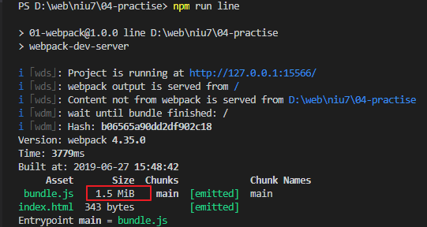

> 现在因为做了css样式的按需引入，打包文件已经变味1.5M了，较比之前优化很多

##### 按需引入组件和事件方法

在src/index.js入口文件处做组件库 **组件** 和 **方法** 的按需引入配置：

```javascript
// Vue.use(ElementUI);			// 注释掉 完整引入

// B. 按需引入 组件和事件方法
import {Row, Button, MessageBox, Message} from 'element-ui'  // es6模块化导入
// 利用use()方法实现单个"组件"的注册
Vue.use(Row)
Vue.use(Button)
// 实现"事件方法"注册
Vue.prototype.$confirm = MessageBox.confirm;
Vue.prototype.$message = Message;
```

> 完整引入注释掉
>
> 按需引入的有两部分内容：组件 和 方法


重启webpack，查看比较打包文件大小，可以对比出`按需引入`的使用效果

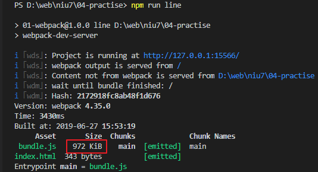

> 现在由于 **组件**和**事件方法** 的按需引入使得打包文件进一步减小，变为972K了


element-ui可以做按需引入注册的全部 组件和方法 [请参考](http://element-cn.eleme.io/#/zh-CN/component/quickstart) 这里


前期开发综合考虑，请只给**css样式**做按需引入即可,项目开发完毕后再一次性给 **组件** 和 **方法** 做按需引入配置


### 小结

1. element-ui本身就是一套组件库，里边提供了各种样式的组件，可以满足大部分业务场景的需要

2. element-ui引入的时候考虑到资源的消耗情况可以分为：完整、按需两种方式

3. 按需引入又分为   ：  css样式        组件/事件方法  两种

   项目开发前期考虑到开发便捷性，只做 css样式按需 引入即可，项目开发完毕再做事件和方法的按需引入

4. element-ui本身分为3部分：`组件`、`css样式`、`事件方法`


# 来去自由


## 注册账号

[http://ttmp.research.itcast.cn](http://ttmp.research.itcast.cn/)是参考项目在线访问地址，为了区分，请使用自己的手机号码登录系统，登录前需要注册，具体步骤如下：

在你的 POSTMAN 接口测试工具中通过post方式请求如下地址：

接口地址：`http://ttapi.research.itcast.cn/app/v1_0/authorizations`

请求方法：`POST`

请求体：

```json
{
  "mobile": "你的手机号",
  "code": "246810"
}
```

登录即可完成注册。

然后你就可以使用  你的手机号 + `246810` 登录后台了。


测试账号：

- 手机号：`13911111111`
- 验证码：`246810`


## 登录系统

目标：实现管理员登录系统功能

### 极验行为验证

请访问  10.8 章节

### 绘制表单

绘制登录表单

通过element组件库的 el-form组件 绘制登录表单效果

```html
<el-form ref="loginFormRef" :model="loginForm">
  <el-form-item>
    <el-input v-model="loginForm.mobile" placeholder="手机号码">
      <i slot="prefix" class="iconfont icon-aui-icon-mobile"></i>
    </el-input>
  </el-form-item>
  <el-form-item>
    <el-input v-model="loginForm.code" placeholder="校验码">
      <i slot="prefix" class="iconfont icon-codes"></i>
    </el-input>
  </el-form-item>
  <el-form-item>
    <el-checkbox v-model="loginForm.xieyi"></el-checkbox>
    <span>我已阅读并同意用户协议和隐私条款</span>
  </el-form-item>
  <el-form-item>
    <el-button type="primary" style="width:100%">登录</el-button>
  </el-form-item>
</el-form>
```

> ref  固定推荐属性，使得组件可以被获取到，例如 this.$refs.xxx
>
> model  固定推荐属性，属性值是data成员，是一个对象，用于获取全部的表单信息，以便后期校验或重置
>
> v-model  双向数据绑定，使得输入的表单域信息可以被表单对象接收到
>
> slot  命名插槽


data部分：

```js
loginForm: {
  mobile: '',
  code: '',
  xieyi: false
},
```


### 表单校验

对表单各个项目进行校验

步骤：

1. 给el-form设置rules属性
2. 在data中制作rules的属性值
3. 给被校验的项目设置prop属性

代码：

```html
<el-form :rules="loginFormRules">
<el-form-item prop="mobile">
<el-form-item prop="code">
```

> 注意：prop属性值要求与表单域名称一致

```js
loginFormRules: {
  mobile: [
    { required: true, message: '手机号码必填', trigger: 'blur' },
    ……
  ],
  code: [
    { required: true, message: '校验码必填', trigger: 'blur' },
    ……
  ]
}
```

> required  必填校验
>
> message  校验失败错误信息提示
>
> trigger  触发校验,blur是失去焦点就执行


注意：

在同一个表单域项目中，可以定义多个校验规则，依次执行


### 自定义校验

组件库默认提供的校验如果不满足要求，就要自行定义校验规则

步骤：

1. 完善表单校验的各个步骤
2. 在data中定义校验器函数
3. 在校验规则中使用校验validator

代码：

```js
data () {
  var checkXieyi = (rule, value, callback) => {
    if (Number(value) === 0) {
      return callback(new Error('请遵守协议'))
    }
    callback()
  }
  return {
    loginFormRules: {
      xieyi: [
        { validator: checkXieyi }
      ]
    }
  }
}  
```

> value  是被校验的数据
>
> callback  是回调函数，无论校验成功会失败都需要执行


### iconfont图标

请访问 10.7 章节

### 登录按钮等待

点击登录后，极验 响应时间可能比较长，为了使得用户体验比较好，可以给按钮制作**等待**效果

代码：

```html
<el-button v-loading="loginBtn">登录</el-button>
```

```js
data(){
  loginBtn: false,
}
```

发起请求时设置v-loading的值为true，完成请求后设置为false


### WebStorage存储账号信息

目标：用户登录系统成功，要把秘钥信息存储到sessionStorage里边

代码：

```js
window.sessionStorage.setItem('userinfo', JSON.stringify(用户信息))
```


注意：

sessionStorage里边只能存储字符串，如果存储对象，需要通过JSON.stringify()转变为字符串

获取出来后想要像对象一样使用，需要通过 JSON.parse()再转一下


## 退出系统

目标：实现管理员退出系统功能

代码：

```html
<el-dropdown-item @click.native="logout()">退出</el-dropdown-item>
```

```js
logout () {
  this.$confirm('确认要退出系统么?', '提示', {
    confirmButtonText: '确定',
    cancelButtonText: '取消',
    type: 'warning'
  })
    .then(() => {
      window.sessionStorage.clear()
      this.$router.push({ name: 'login' })
    })
    .catch(() => {})
}
```


注意：

el-dropdown-item本身是一个组件，直接定义事件不起作用，需要额外声明native，表示针对内部的具体html标签生效


# 开门见山

## 容器布局

目标：绘制后台容器布局效果

代码：

```html
<el-container>
  <el-aside width="200px">Aside</el-aside>
  <el-container>
    <el-header>Header</el-header>
    <el-main>Main</el-main>
  </el-container>
</el-container>
```

css样式

```html
<style lang="less" scoped>
.el-container {
  height: 100%;
  .el-aside {
    background-color: #323745;
    .el-submenu,
    .el-menu-item {
      width: 200px;
    }
  }
  .el-header {
    font-family: "Microsoft YaHei";
    background-color: #fff;
    .showheader {
      height: 100%;
      display: flex;
      align-items: center;
    }
  }
  .el-main {
    background-color: #f2f3f5;
  }
}
</style>
```


## 绘制头部

目标：绘制后台系统的头部

模板代码：

```html
<el-header>
  <div class="youbian">
    <el-input placeholder="请输入搜索关键字"></el-input>
    <span>消息</span>
    <el-dropdown trigger="click">
      <span class="el-dropdown-link">
        
        小强
        <i class="el-icon-caret-bottom"></i>
      </span>
      <el-dropdown-menu slot="dropdown">
        <el-dropdown-item>个人信息</el-dropdown-item>
        <el-dropdown-item>退出</el-dropdown-item>
      </el-dropdown-menu>
    </el-dropdown>
  </div>
  <div class="zuobian">
    <i class="el-icon-s-fold" style="margin-right:10px;"></i>
    <span>江苏传智播客教育科技股份有限公司</span>
  </div>
</el-header>
```

> 提前准备avatar2.jpg图片
>
> 用到了elementui下拉菜单组件 el-dropdown

css样式：

```css
.zuobian {
  height: 60px;
  line-height: 60px;
  float: left;
}
.youbian {
  height: 60px;
  // line-height:60px;
  display: flex;
  align-items: center;
  justify-content: center;
  float: right;
  span {
    width: 70px;
    margin: 0 10px;
  }
  .el-dropdown {
    width: 240px;
  }
}
```


## 绘制左侧

目标：绘制左侧菜单导航效果

代码：

```html
<el-menu
  background-color="#353B4E"
  text-color="#fff"
  active-text-color="#409EFF"
>
  <el-menu-item index="1">
    <i class="el-icon-menu"></i>
    <span slot="title">首页</span>
  </el-menu-item>
  <el-submenu index="2">
    <template slot="title">
      <i class="el-icon-location"></i>
      <span>内容管理</span>
    </template>
    <el-menu-item index="2-1">发布文章</el-menu-item>
    <el-menu-item index="2-2">内容列表</el-menu-item>
  </el-submenu>
</el-menu>
```

> index  固定属性，用以区分不同的菜单项目，后期可以填充上请求的路由地址信息
>
> el-menu-item  表示的是没有子级的菜单项目
>
> el-submenu  表示的是有子级的菜单项目


## 左侧导航收起/展开

目标：给后台首页头部制作一个按钮，单击后实现左侧菜单的收起和展开效果

步骤和代码：

1. template模板制作切换单击标签

   ```html
   
     <i
       :class="menuCollapse?'el-icon-s-unfold':'el-icon-s-fold'"
       style="cursor:pointer;"
       @click="menuCollapse=!menuCollapse"
     ></i>
   
   ```

   

2. 给el-menu菜单组件添加相关属性

   ```html
   <el-menu
     :collapse="menuCollapse"  // 开启 收起、展开 功能
     :collapse-transition="false" // 屏蔽动画
   >
   ```

   

3. el-aside布局组件要根据情形做收起、展开配合

   ```html
   <el-aside :width="menuCollapse?'65px':'200px'">
   ```

   

4. data成员控制 收起、展开

   ```js
         menuCollapse: false
   ```


## 禁止随意访问

后台系统只有通过正确的账号登录进来才运行访问，如果在浏览器地址栏里边输入请求地址是不允许访问的，相反还要让浏览器跳转到登录页面

目标：对非登录用户限制访问

代码：

```js
router.beforeEach((to, from, next) => {
  var token = window.sessionStorage.getItem('token')
  if (!token && to.path !== '/login') {
    return router.push({ name: 'login' })
  }
  next()
})
```


# 文章统筹

## 文章列表显示

### 查询表单域绘制

目标：绘制查询各项表单域

步骤和代码：

```html
// 单选按钮
<el-form-item label="文章状态：">
  <el-radio-group v-model="searchForm.status">
    <el-radio label="">全部</el-radio>
    <el-radio label="0">草稿</el-radio>
    <el-radio label="1">待审核</el-radio>
    <el-radio label="2">审核通过</el-radio>
    <el-radio label="3">审核失败</el-radio>
  </el-radio-group>
</el-form-item>
```

> v-model  双向绑定，可以 设置 或 获取 选中的项目的值 
>
> 例如：
>
> searchForm:{
>
> ​	status:"2"     // 表示  审核通过项目选中
>
> }
>
> label  就是各个单选按钮的value值


```html
// 频道下拉列表
<el-form-item label="频道列表：">
  <el-select v-model="searchForm.channel_id" clearable>
    <el-option
      v-for="item in channelList"
      :key="item.id"
      :label="item.name"
      :value="item.id"
    ></el-option>
  </el-select>
</el-form-item>
```

> v-model  双向绑定，与单选按钮一致，可以 设置 或 获取 选中的项目的值 
>
> label  是下拉列表项目对外提示的名称
>
> value  是项目的value值


```html
// 时间选取器
<el-form-item label="时间选择：">
  <el-date-picker
    v-model="timetotime"
    type="daterange"
    range-separator="至"
    start-placeholder="开始日期"
    end-placeholder="结束日期"
    value-format="yyyy-MM-dd"
  ></el-date-picker>
</el-form-item>
```

> value-format  用于限定获取到时间的格式
>
> v-model  获取选中的时间信息


data成员：

```js
channelList: [],  // 频道列表
timetotime: '',		// 时间选择器
// 表单对象
searchForm: {
  status: '',  // 文章状态
  channel_id: '', // 频道
  begin_pubdate: '', // 开始时间
  end_pubdate: '', // 结束时间
}
```

> 为了使得后期开发方便，以上searchForm对象内部的成员名称都来之api接口，不要自定义为其他的


监听器watch：

```js
// 用户选取了时间后，要触发监听器，把时间信息拆分到表单域的对应字段中
watch: {
  timetotime: function (newval) {
    this.searchForm.begin_pubdate = newval[0]
    this.searchForm.end_pubdate = newval[1]
  }
},
```


methods方法 和 created方法

```js
created(){
  this.getChannelList()
},
// 获取频道列表信息
async getChannelList () {
  try {
    var { data: dt } = await this.$http.get('/channels')
    this.channelList = dt.data.channels
  } catch (err) {
    this.$message.error('获取频道发生错误')
  }
},
```


### 配置token

客户端向服务器端发请求获得数据，服务器端要求客户端传递token秘钥数据，没有token秘钥的请求统统不给与响应


目标：给axios配置token，使得每次请求都自动携带

代码：

```js
// 请求拦截器
axios.interceptors.request.use(function (config) {
  var userinfo = JSON.parse(window.sessionStorage.getItem('userinfo'))
  if (userinfo && userinfo.token) {
    config.headers.Authorization = `Bearer ${userinfo.token}`
  }

  return config
}, function (error) {
  return Promise.reject(error)
})
```

> 传递token的字段名称为 Authorization，前边要设置 "Bearer "前缀，Bearer后边有一个空格


token在服务器端有过期时间，默认是2小时，如果过期了，就要强制用户退出系统并重新登录

目标2：判断token过期，强制登录

代码：

```js
// 响应拦截器
axios.interceptors.response.use(function (response) {
  return response
}, function (error) {
  if (error.response.status === 401) {
    return router.push({ name: 'login' })
  }
  return Promise.reject(error)
})
```

> 如果token在服务器端已经过期，其会返回401的状态，我们客户端判断并处理即可


### 文章列表效果

目标：通过api接口获取文章列表信息，并以列表形式显示出来

代码：

```html
// 通过el-table表格组件绘制数据表格
<el-table :data="articleList" style="width:100%;">
  <el-table-column label="图片" width="100">
    
  </el-table-column>
  <el-table-column label="标题" prop="title"></el-table-column>
  <el-table-column label="发布日期" prop="pubdate" width="100"></el-table-column>
  <el-table-column label="状态" prop width="100">
    <template slot-scope="stData">
      <el-tag v-if="stData.row.status=='0'">草稿</el-tag>
      <el-tag v-else-if="stData.row.status=='1'" type="success">待审核</el-tag>
      <el-tag v-else-if="stData.row.status=='2'" type="info">审核通过</el-tag>
      <el-tag v-else-if="stData.row.status=='3'" type="warning">审核失败</el-tag>
      <el-tag v-else-if="stData.row.status=='4'" type="danger">已删除</el-tag>
    </template>
  </el-table-column>
  <el-table-column label="操作" width="180">
    <template slot-scope="stData">
      <el-button type="primary" size="mini">修改</el-button>
      <el-button type="danger" size="mini">删除</el-button>
    </template>
  </el-table-column>
</el-table>
```

> data属性  表格数据来源
>
> el-table-column组件  各个列的体现
>
> label  表格的标题头信息
>
> prop  表格数据字段
>
> width="100"  对各个列的宽度进行限制，有一个列可以不设置，以达到自适应效果
>
> slot-scope  作用域插槽
>
> template  透明标签，只执行，但是浏览器源代码不显示


data成员：

```
channelList: []
```

methods方法和created成员

```js
created () {
	// 获取文章列表
  this.getArticleList()
},
// 获得文章列表方法
async getArticleList () {
  this.tableshow = true
  var searchFormAfter = {}
  // 把searchForm中空成员做清除操作，最后传递searchFormAfter作为条件使用
  for (var i in this.searchForm) {
    if (this.searchForm[i] !== '') {
      searchFormAfter[i] = this.searchForm[i]
    }
  }

  try {
    var { data: dt } = await this.$http.get('/articles', {
      params: searchFormAfter
    })
    // console.log(dt)
    this.articleList = dt.data.results  // 把文章列表赋予给articleList成员
    this.tot = dt.data.total_count
    this.tableshow = false
  } catch (err) {
    this.$message.error('获取评论信息发生错误' + err)
  }
}
```

注意：

获取文章列表信息，需要拼装各种筛选条件，根据接口提示，如果参数为空，则不要传递给后端，故要做清除操作


### 分页效果

目标：给文章列表实现分页效果

代码：

分页组件(应用时自行去除注释信息)：

```html
<el-pagination
@size-change="handleSizeChange"     	// 每页信息条数变化的事件函数回调处理声明
@current-change="handleCurrentChange" 	// 当前页码变化事件函数回调处理声明
:current-page="searchForm.page"		   // 当前默认页码
:page-sizes="[10, 15, 20, 30]"		   // 下拉列表每页条数设定
:page-size="searchForm.per_page"						  // 默认每页记录条数设定
layout="total, sizes, prev, pager, next, jumper"  // 页码列表布局效果
:total="tot"						  // 总记录条数，需要另行获取
:disabled="true/false"	   // 可以禁用或激活按钮
></el-pagination>
```

> 服务器接口要求每页获取的文章条数要在10-50条之间，过少或过多 都不允许

Vue实例的data对分页的数据支持

```javascript

tot: 0,  // 记录总条数
searchForm: {
  page: 1,  // 当前页码
  per_page: 10 // 每页显示条数
}
```

注意：page、per_page的名称来自于接口，不要更改


获取文章数据后要对数据总条数成员进行填充

```js
this.tot = dt.data.total_count
```


Vue实例的methods对分页的方法支持

```javascript
/**  数据分页相关1 */
// 每条记录条数变化的回调处理
handleSizeChange(newsize) {
  // newsize: 变化后的记录条数
  this.searchForm.per_page = newsize
  // 重新根据条件获得数据
  this.getArticleList()
},
// 当前页码变化的回调处理
handleCurrentChange(newpage) {
  // newpage: 变化后的当前页码值
  this.searchForm.page = newpage
  // 根据变化后的页码重新获得数据
  this.getArticleList()
},
/** 数据分页相关2 */
```


在global.css给分页做统一样式

```css
/*给el-table设置统一样式*/
.el-table{
  margin-top:15px;
  font-size:12px;
}
```


## 删除文章

大数字处理


删除完毕没有数据返回

删除后刷新数据处理


## 文章状态

在列表中显示文章：待审核、审核通过、审核失败、已删除

template标签

作用域插槽


## 筛选文章

单选按钮

频道列表

时间选取器watch应用


### watch监听器

watch监听：

vue的data数据部分可以被监听，数据一旦发生变化马上可以感知到，并做相关处理

 

watch 监听的特点：监听到某个数据的变化后，侧重于**做某件事情**；

只要被监听的数据发生了变化，会自动触发 watch 中指定的处理函数；

#### 直接监听

当被监听的数据发生变化时，自然执行

语法：

```js
data(){
  return {
    name:'',
    addr:'',
    cat:{
      leg:'',
      tail:'',
      son:{
        name:'kitty',
        weight:5
      }
    }
  }  
}
```

 

```js
watch:{
	data成员名称: 函数(变化后的值，变化前的值){}
  name:function(newval,oldval){},
  addr:function(newval,oldval){},
  'cat.leg':function(newval,oldval){},
  'cat.tail':function(){}
  // 该回调会在任何被侦听的对象的 成员 改变时被调用，不论其被嵌套多深
  cat: {
    handler: function (newval, oldVal) { /* ... */ },
    deep: true
  }
}
```

> 简单字符串成员可以监听，例如name、addr，复杂的对象，但是需要通过**点**连接被监听的成员(例如cat.leg和cat.tail)，并且要通过**引号**圈选
>
> 对象有多个成员并且多层次也可以监听，但是需要配置deep成员


#### 控制监听

在需要的条件后，再开启监听

```js
vm对象.$watch('成员名称', 
  function () {
  	做某些事情
	}, 
参数)
```


## 添加文章

封面相关：

3图封面图片模板参考代码：

```html
<ul>
  <li class="uploadbox" v-for="item in covernum" :key="item">
    <span>点击图标选择图片</span>
    
    <div v-else class="el-icon-picture-outline"></div>
  </li>
</ul>
```

css代码：

```css
.uploadbox {
  list-style: none;
  width: 200px;
  height: 200px;
  margin: 10px;
  float: left;
  cursor: pointer;
  border: 1px solid #eee;
  span {
    width: 200px;
    height: 50px;
    line-height: 50px;
    display: block;
    text-align: center;
  }
  div {
    width: 200px;
    height: 150px;
    font-size: 100px;
    display: flex;
    justify-content: center;
    align-items: center;
    background-color: #fff;
  }
  img{
    width: 200px;
    height: 150px;
  }
}
```


素材图片模板参考代码：

```html
<ul>
  <li class="image-box" v-for="item in imageList" :key="item.id">
    
  </li>
</ul>
```

对应css样式：

```css
.image-box {
  list-style: none;
  width: 200px;
  height: 140px;
  background-color: #fff;
  margin: 10px;
  float: left;
  border: 1px solid #eee;
  cursor:pointer;
  box-sizing:border-box;
  img {
    width: 100%;
    height: 100%;
  }
}
```


### 封面图片处理

1. el-tabs标签切换组件应用

   ```
   <el-tabs v-model="activeName" @tab-click="handleClick">
     <el-tab-pane label="上传图片" name="upload">
       <el-upload
         class="avatar-uploader"
         action="http://ttapi.research.itcast.cn/mp/v1_0/user/images"
         :show-file-list="false"
         name="image"
         :headers="{ Authorization: 'Bearer ' + $store.state.user.token }"
         :on-success="handleAvatarSuccess"
       >
         
         <i v-else class="el-icon-plus avatar-uploader-icon"></i>
       </el-upload>
     </el-tab-pane>
     <el-tab-pane label="媒体库" name="media">
       <div v-for="item in mediaList" :key="item.id" @click="clkImage">
         <div class="image_list">
           
         </div>
       </div>
     </el-tab-pane>
   </el-tabs>
   ```

2. data成员

   ```
         mediaList: [], // 素材图片
         mediaUrl: '', // 选取的媒体库图片路径名
         activeName: 'upload', // 封面图片上传
   ```

   

3. methods方法

   ```
       // 展示上传图片对话框
       async showUploadDialog (n) {
         // 获取素材图片资源
         var { data: dt } = await this.$http.get('/user/images')
         this.mediaList = dt.data.results
       },
       // 清除全部媒体图片的选中效果
       clearMedia () {
         var images = document.querySelectorAll('.image_list')
         for (var x = 0; x < images.length; x++) {
           images[x].style.border = ''
         }
       },
       // 媒体库单元被选中
       clkImage (evt) {
         this.clearMedia()
         evt.target.parentNode.style.border = '2px solid blue'
         this.mediaUrl = evt.target.src
       },
      	// 切换标签被单击
       handleClick () {
         if (this.activeName === 'upload') {
           this.mediaUrl = ''
           this.clearMedia()
         } else {
           this.uploadUrl = ''
         }
       },
       // 上传图片 或 媒体库素材 确定选取
       uploadOk () {
         if (!this.uploadUrl && !this.mediaUrl) {
           return this.$message.error('请选取封面图片素材！')
         }
         this.publishForm.cover.images[this.up] = this.uploadUrl ? this.uploadUrl : this.mediaUrl
         this.dialogVisible = false
         this.uploadUrl = '' // 清除已经上传图片的路径名
         this.mediaUrl = '' // 清除选取的素材图片
         this.clearMedia() // 清除选中效果
        	this.activeName = 'upload' // 恢复标签为上传图片
       },
   ```

   

4. css样式支持

   ```
   .image_list {
     width: 128px;
     height: 100px;
     float: left;
     margin: 5px 5px;
     cursor: pointer;
     box-sizing:border-box;
     img {
       width: 100%;
       height: 100%;
     }
   }
   ```


### 数据接口请求地址处理

为了使得 接口api 根地址只维护一份，提高开发效率，可以做如下设置，后期如果变化，只修改common.js一处代码即可

制作配置文件src\assets\js\common.js，内容如下：

```
export default {
  apiUrl: 'http://ttapi.research.itcast.cn/mp/v1_0/'
}
```

在各个应用处把common.js当做模块引入使用

```
import Common from '@/assets/js/common.js'
console.log(Common.apiUrl)
```


​	dialog弹框

## 修改文章

watch检测数据变化，离开后要提示

## 评论列表

el-table表格展示数据

## 是否允许评论

el-switch

作用域插槽


# 当家人洗心革面

## 基本信息更新

## 头像更新

上传头像

vuex及时更新数据


# 素材有备无患

列表展示

收藏

删除


素材图片模板html标签代码：

```html
<ul>
  <li class="image-box" v-for="item in 20" :key="item">
    
    <div class="image-bot">
      <el-button type="success" icon="el-icon-star-off" circle ></el-button>
      <el-button type="danger" icon="el-icon-delete" circle></el-button>
    </div>
  </li>
</ul>
```

对应的css样式：

```css
.image-box {
  list-style: none;
  width: 200px;
  height: 200px;
  background-color: #fff;
  margin: 10px;
  float: left;
  border: 1px solid #eee;
  img {
    width: 200px;
    height: 140px;
  }
  .image-bot {
    width: 200px;
    height: 60px;
    line-height: 60px;
    text-align: center;
  }
}
```


# 整装待发(待优)

## 打包

运行指令

```
npm run build
```


> 首次打包的主js文件大小为1724kb(1.7M)，比较大
>
> dist\css\app.xxx.css                             各个组件的css样式、global.css的样式
>
> dist\css\chunk-vendors.xxx.css          elementui组件库样式打包文件
>
> dist\js\app.xxx.js								   应用级js打包文件
>
> dist\js\chunk-vendors.284fcc8b.js     系统级js打包文件


运行指令

```
.\node_modules\.bin\vue-cli-service build --report
```

> 附带--report参数，作用是打包的同时生成分析报告

这样在dist目录中就会生成report.html文件

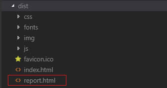

其被访问的效果如下，告知各个文件在打包文件中的占比情况，为优化提供参考根据


## 优化处理

### externals方案


webpack会把网站运行需要的全部 js、css、img 做打包处理，打包好的文件再对外提供网络服务使用，如果全部的文件都是我们<span style="background-color:yellow;">自己的服务器</span>提供支持，势必增加服务器负担(也会造成打包文件较大)，有一些文件其实可以通过<span style="background-color:yellow;">外网服务器</span>提供(第三方公司服务器)，好处是可以减轻我们自己服务器的工作负担。

网站部署时把一些静态资源通过外网方式提供出来，以节省自己服务器资源的优化方案称为“externals”


在vue.config.js文件中配置如下内容

```javascript
  configureWebpack: config => {
    // 配置 externals
    // 防止将某些 import 的包(package)打包到 bundle 中，
    // 而是在运行时(runtime)再去从外部获取这些扩展依赖
    config.externals = {
      // 包名(from后边的名字): 构造函数名称(文件内部提供的全局变量名字)
      vue: 'Vue',
      axios: 'axios',
      'vue-router': 'VueRouter',
      echarts: 'echarts',
      nprogress: 'NProgress',
      vuex:'Vuex'
    }
  }
```

在主容器文件中通过外部方式引入上述配置的各个静态文件

```html
<link href="https://cdn.bootcss.com/nprogress/0.2.0/nprogress.min.css" rel="stylesheet"  />
<script src="https://cdn.bootcss.com/nprogress/0.2.0/nprogress.min.js"></script>
<script src="https://cdn.bootcss.com/vue/2.6.10/vue.runtime.min.js"></script>
<script src="https://cdn.bootcss.com/axios/0.19.0/axios.min.js"></script>
<script src="https://cdn.bootcss.com/vue-router/3.0.7/vue-router.min.js"></script>
<script src="https://cdn.bootcss.com/echarts/4.2.1/echarts.min.js"></script>
```

再次打包并生成report.html报告文件

```
.\node_modules.bin\vue-cli-service build --report
```


> 此时主js打包文件已经变味 825kb了，约等于原值的一半大小了


经查看已经没有vue、axios、echarts、nprogress、vue-router文件包组成了

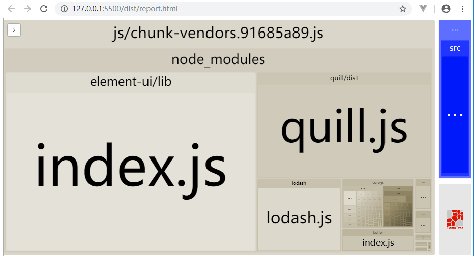


### 查看构造函数名字(了解)

通过代码自行查看各个功能模块内部的构造函数名称

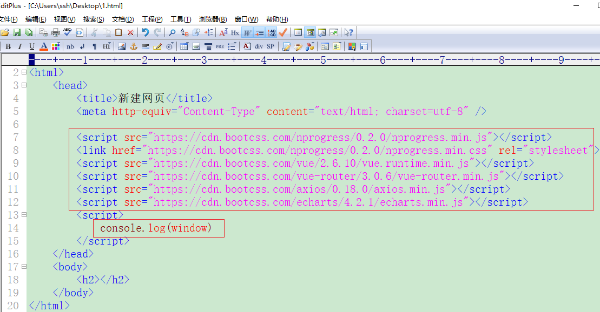

通过浏览器firebug调试工具查看


### ElementUI优化

在main.js主入口文件中给element-ui组件库做<span style="background-color:yellow;">按需导入</span>设置，去除没有使用的组件，进一步精简项目的总代码量

1. 注释掉完整引入和注册：

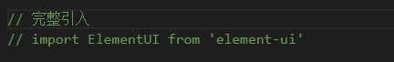

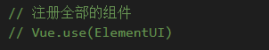

2. 导入并注册需要的组件和方法

   ```
   // 按需导入需要的组件
   import {
     DatePicker,
     Dropdown,
     DropdownMenu,
     DropdownItem,
     Pagination,
     Dialog,
     Menu,
     Submenu,
     MenuItem,
     Input,
     Radio,
     RadioGroup,
     RadioButton,
     Checkbox,
     Select,
     Option,
     Button,
     Table,
     TableColumn,
     Form,
     FormItem,
     Tabs,
     TabPane,
     Tag,
     Icon,
     Row,
     Col,
     Upload,
     Card,
     Container,
     Header,
     Aside,
     Main,
     MessageBox,
     Message
   } from 'element-ui'
   // 注册组件
   Vue.use(DatePicker)
   Vue.use(Dropdown)
   Vue.use(DropdownMenu)
   Vue.use(DropdownItem)
   Vue.use(Pagination)
   Vue.use(Dialog)
   Vue.use(Menu)
   Vue.use(Submenu)
   Vue.use(MenuItem)
   Vue.use(Input)
   Vue.use(Radio)
   Vue.use(RadioGroup)
   Vue.use(RadioButton)
   Vue.use(Checkbox)
   Vue.use(Select)
   Vue.use(Option)
   Vue.use(Button)
   Vue.use(Table)
   Vue.use(TableColumn)
   Vue.use(Form)
   Vue.use(FormItem)
   Vue.use(Tabs)
   Vue.use(TabPane)
   Vue.use(Tag)
   Vue.use(Icon)
   Vue.use(Row)
   Vue.use(Col)
   Vue.use(Upload)
   Vue.use(Card)
   Vue.use(Container)
   Vue.use(Header)
   Vue.use(Aside)
   Vue.use(Main)
   // 注册方法
   Vue.prototype.$confirm = MessageBox.confirm
   Vue.prototype.$message = Message
   ```
   
3. 再次打包并生成report.html分析日志文件

   ```
   .\node_modules\.bin\vue-cli-service build --report
   ```

   

   > 发现主js打包文件又近一步优化缩小到 704kb了，并且主css文件也变为 197kb

   

   

   运行report.html日志文件，发现element-ui文件包占比已经缩小了

   


> Stat：文件没有被webpack打包处理的原始大小
>
> Parsed：已经webpack打包优化处理后大小
>
> Gzipped：经过浏览器传输压缩后还可以变得更小


## 发布

### 初始化项目

在项目运行目录(自定义即可)运行如下指令，生成package.json文件

```
npm -y init
```


### 安装express

运行如下指令，安装express模块，以便可以创建http服务

```
yarn add express
```


### 创建服务运行

把打包好的文件目录dist复制到运行目录里边


通过node方式创建http服务，以运行项目

创建app.js文件，并设置如下内容：

```javascript
// 导入express
var express = require('express')

// 创建express实例对象
var app = express()

// 托管设置
app.use(express.static('./dist'))

// 创建http服务
app.listen(9876,function(){
  console.log('项目运行在\nhttp://127.0.0.1:9876')
})
```


运行项目：


### 优化处理

给项目安装<span style="background-color:yellow;">compression模块</span>，使得程序文件经网络传输时被压缩处理，更节省带宽资源

运行如下指令

```
yarn add compression
```


http服务应用compression压缩机制，在app.js文件中设置如下内容


重启服务运行效果：


> 705KB 是主js打包文件原大小
>
> 173KB 是文件被服务器端compression压缩后网络传输大小


# 奇技淫巧

## NProgress

进度条库是前端中常见的库之一

nprogress是轻量级的ajax进度条应用，灵感来自Google, YouTube, and Medium。

纳米级的进度条。 具有逼真的动画涓涓细流来说服你的用户，something is happen！


参考官网

[http://ricostacruz.com/nprogress/](http://ricostacruz.com/nprogress/)

[https://www.npmjs.com/package/nprogress](https://www.npmjs.com/package/nprogress)

[参考学习网站](https://www.cnblogs.com/y114113/p/6289629.html)

### 安装

运行指令

```
yarn add nprogress
```


### 引入

在main.js中对js包 和 css样式包进行引入

```
import NProgress from 'nprogress'
import 'nprogress/nprogress.css'
```


### 使用

进度条的**显示和关闭**可以调用如下方法实现：

```
NProgress.start() - 显示进度条【显示】
NProgress.set(0.4) - 设置百分比【显示】
NProgress.inc() - 稍微增加【显示】
NProgress.done() - 完成进度(进度条消失)【关闭】
```


在main.js中，给axios的**请求**和**响应**拦截器使用nprogress，

为axios配置请求进度条

```js
// axios的请求拦截器(显示进度条)
NProgress.start()    // 或set(0.4)  或 inc()

// axios的响应拦截器(关闭进度条)
NProgress.done()

```


如果想给进度条自定义样式，可以修改nprogress/nprogress.css文件进行设置


## 大数字处理

有的整数信息很大，已经超出了js可以表达的范畴，这时需要额外进行处理

```js
// js可以使用的正常整数最大值
console.log(Number.MAX_SAFE_INTEGER)    // 9007199254740991
```

json-bigint使用之前需要安装

```bash
yarn add json-bigint
```


```js
var JSONbig = require('json-bigint');

var json = '{ "value" : 9223372036854775807, "v2": 123 }';
console.log('Input:', json);
console.log('');

console.log('node.js bult-in JSON:')
var r = JSON.parse(json);
console.log('JSON.parse(input).value : ', r.value.toString());
console.log('JSON.stringify(JSON.parse(input)):', JSON.stringify(r));

console.log('\n\nbig number JSON:');
var r1 = JSONbig.parse(json);
console.log('JSONbig.parse(input).value : ', r1.value.toString());
console.log('JSONbig.stringify(JSONbig.parse(input)):', JSONbig.stringify(r1));
```

结果：

```js
Input: { "value" : 9223372036854775807, "v2": 123 }

// 普通方式处理后，大数字变型了
node.js bult-in JSON:
JSON.parse(input).value :  9223372036854776000
JSON.stringify(JSON.parse(input)): {"value":9223372036854776000,"v2":123}

// json-bigint技术处理后，信息还是原样的
big number JSON:
JSON.parse(input).value :  9223372036854775807
JSON.stringify(JSON.parse(input)): {"value":9223372036854775807,"v2":123}
```


方法解释：

```js
JSONbig.parse(字符串对象)  	// 把 字符串对象 变为 表达式对象
对象.大数字成员.toString()		// 把 大数字 成员 变为可表现的数字信息
JSONbig.stringify(对象)			// 把 表达式对象 变为 字符串对象
```


```js
JSON.parse(字符串对象)			// 把 字符串对象 变为 表达式对象
JSON.stringify(对象)			// 把 表达式对象 变为 字符串对象
```


## echarts

### 介绍

1. 什么是

   商业级数据图表，它是一个纯JavaScript的图标库，兼容绝大部分的浏览器，底层依赖轻量级的canvas类库ZRender，提供直观，生动，可交互，可高度个性化定制的数据可视化图表。创新的拖拽重计算、数据视图、值域漫游等特性大大增强了用户体验，赋予了用户对数据进行挖掘、整合的能力。


2. 支持的图表

   折线图（区域图）、柱状图（条状图）、散点图（气泡图）、K线图、饼图（环形图）

   雷达图（填充雷达图）、和弦图、力导向布局图、地图、仪表盘、漏斗图、事件河流图等各种图表


[参考官网](http://echarts.baidu.com/)


### 使用


1. 安装

   ```
   yarn add echarts
   ```

2. 应用程序引入echarts

   ```javascript
   import echarts from 'echarts'
   ```

3. 应用程序创建显示容器

   > 自行创建Report.vue 和 配置路由

   ```html
   <div id="tubiao" style="width: 750px;height:400px;"></div>
   ```

4. 绘制图表

   ```javascript
   export default {
     mounted() {
       this.paintDataPic()
     },
     methods: {
       paintDataPic() {
         // 基于准备好的dom，初始化echarts实例
         var myChart = echarts.init(document.getElementById('tubiao'))
         // 绘制图表
         myChart.setOption({
           title: {
             text: '某站点用户访问来源',
             subtext: '纯属虚构',
             x: 'center'
           },
           tooltip: {
             trigger: 'item',
             formatter: '{a} <br/>{b} : {c} ({d}%)'
           },
           legend: {
             orient: 'vertical',
             left: 'left',
             data: ['直接访问', '邮件营销', '联盟广告', '视频广告', '搜索引擎']
           },
           series: [
             {
               name: '访问来源',
               type: 'pie',
               radius: '55%',
               center: ['50%', '60%'],
               data: [
                 { value: 335, name: '直接访问' },
                 { value: 310, name: '邮件营销' },
                 { value: 234, name: '联盟广告' },
                 { value: 135, name: '视频广告' },
                 { value: 1548, name: '搜索引擎' }
               ],
               itemStyle: {
                 emphasis: {
                   shadowBlur: 10,
                   shadowOffsetX: 0,
                   shadowColor: 'rgba(0, 0, 0, 0.5)'
                 }
               }
             }
           ]
         })
       }
     }
   }
   ```

   

相关参考效果实现：

[5 分钟上手 ECharts](https://www.echartsjs.com/tutorial.html#5%20%E5%88%86%E9%92%9F%E4%B8%8A%E6%89%8B%20ECharts)

[饼状图效果实现](https://www.echartsjs.com/examples/editor.html?c=pie-simple)


### 参数说明

[请参考网址](https://www.echartsjs.com/option.html)


### 异步更新数据


## async和await


**ES7** 中的 async 和 await 可以简化 Promise 调用，提高 Promise 代码的 阅读性 和 理解性；

async和await结合起来，可以使得异步调用不返回Promise，而直接把then<font color="red">参数方法的行参</font>给返回出来，使得代码更节俭，提高代码开发效率，也可以保证异步调用的**顺序**执行。


语法：

```js
async function xxx(){
  var result = await yyy()
}
```

> yyy()返回结果是Promise对象，由于async/await介入，result的结果就是then参数方法的形参了


axios发起的任何请求的返回结果都是Promise对象，可以通过 [async]()和[await]() 简化返回结果，提高开发速度

```javascript
async function xxx(){
  // axios.get().then(res => {})  原始用法
  var result = await axios.get()
  var result = await axios.post()
}
```

> result 与 res 作用相同


async、await各种使用情形：

```javascript
var obj = {
  async getInfo(){
    await getXXXX()
    await getXXXX()
  }
}
或
function ffff(){
    // async需要设置到Promise对象的外层最近function的前边位置
  getInfo(async function(){
 		await getXXXX()
    //console.log(getXXXX())
  })
}
或
async function XXXX(){
  await getXXXX()
}
```

注意：

- async需要设置到Promise对象外边**最近**的function前边位置
- await必须结合async一并使用
- async可以独立修饰函数使用，返回值是Promise对象
- 一个async可以对应**多个**await
- await 后面可以跟任何的JS 表达式，但是修饰 **Promise对象** 更有意义


## 富文本编辑器


[富文本编辑器参考官网](https://www.npmjs.com/package/vue-quill-editor)

编辑器名称为：vue-quill-editor

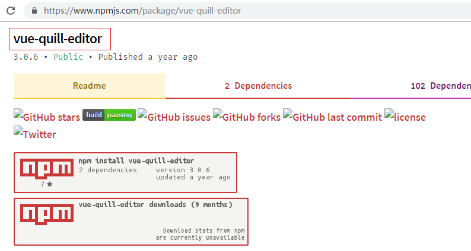

1. 运行指令安装

   ```
   yarn add vue-quill-editor
   ```

2. 在GoodsAdd.vue组件中导入富文本编辑器 并注册给Vue

   ```js
   // 导入富文本编辑器相关
   import 'quill/dist/quill.core.css'
   import 'quill/dist/quill.snow.css'
   import 'quill/dist/quill.bubble.css'
   import { quillEditor } from 'vue-quill-editor'
   ```

3. 使用

   注册编辑器组件

   ```json
   components: {
     // 富文本编辑器组件
     quillEditor
   }
   ```

   使用编辑器组件

   ```php+HTML
   <el-tab-pane label="商品内容" name="4">
     <quillEditor v-model="addForm.goods_introduce" ref="myQuillEditor"></quillEditor>
   </el-tab-pane>
   ```

   data中声明表单数据对象成员

   ```json
   // 表单数据对象
   addForm: {
     ……
     goods_introduce: ''		// 商品介绍
   }
   ```

   global.css中给编辑器设置样式

   ```css
   /* 富文本编辑器设置样式*/
   .quill-editor {
     margin-bottom: 15px;
   }
   .ql-editor{
     height:200px;
   }
   
   ```

4. 效果：

   

   


## WebStorage技术

webstorage是浏览器里边存储数据的技术，是html5发行的

### cookie缺陷

之前在浏览器端可以利用cookie存储一些业务相关信息，但是cookie本身有自己的一些缺陷
具体表现为：

1. 大小受限，每个cookie有**4k**限制
2. 用户可以操作（禁用）cookie，使功能受限
3. 安全性较低
4. 每次访问都要传送cookie给服务器，浪费带宽
5. cookie数据有路径（path）的概念、协议、时间的概念，限制其只属于某个路径下


### webstorge特点

HTML5为克服由cookie所带来的一些限制提出发布了WebStorage的浏览器技术


WebStorage使用特点为：

1. 存储空间更大：单个item数据大小可以达到[5MB]()
2. 节省网络流量：WebStorage不会传送到服务器，存储在本地的数据可以直接获取使用
3. 只能存储**字符串**类型

 

WebStorage的实现具体分为两种：

- localStorage（本地存储）：持久存储
- sessionStorage（会话存储）：会话级(临时)存储，数据是临时的(关闭浏览器或关闭浏览器标签都会造成数据丢失)

 

各自特点为：

localStorage的生命周期是永久的，关闭页面或浏览器之后localStorage中的数据也不会消失。除非主动删除数据，否则数据永远不会消失

sessionStorage的生命周期是在仅在当前会话下有效，只要这个浏览器`标签窗口`没有关闭，即使刷新页面或者进入同源另一个页面，数据依然存在，关闭了浏览器标签窗口后就会被销毁


应用场景：

localStorage：用于长期登录（+判断用户是否已登录），适合长期保存在本地的数据。

sessionStorage：敏感账号一次性登录


### 相关方法

WebStorage提供的相关方法：

```javascript
setItem (key, value) 	 // 保存数据，以键值对的方式储存信息。
getItem (key) 			//  获取数据，将键值传入，即可获取到对应的value值。
removeItem (key) 		//  删除单个数据，根据键值移除对应的信息。
clear () 			    //  删除所有的数据
```

window.localStorage.setItem()

window.sessionStorage.setItem()

获取方式：

- localStorage：window.localStorage;
- sessionStorage：window.sessionStorage;


### 案例

利用 " **路由守卫** + **sessionStorage** " 实现**非登录用户**访问后台首页就   **强制**去登录的效果


上图：前后端分离式项目开发，用户首次**登陆**系统，服务器端要给前端分配一个**token**，代表令牌，表示当前前端账号有权利对后端服务器进行访问，具体就是数据 增、删、改、查 操作

token本身在服务器端有时效，过期后需要重新获取

token的使用避免了每次请求输入用户名和密码账号了，token是用户名和密码的变形，但都是是加密信息，更安全

反过来讲，如果前端登录用户没有获取到token，则不允许其登录系统，相反要强制登录


## iconfont图标库

element-ui提供了一些图标，但是数量有限，如果需要其他图标可以去 阿里妈妈图标库 网站下载使用更全的图标

[图标库官网](https://www.iconfont.cn/)

具体使用：

1. 把下载好的图标库文件复制到项目指定位置(assets目录下)：

2. 在Login.vue组件中引入图标库样式文件

   ```javascript
   // 引入“图标”css样式文件
   import './assets/fonts/iconfont.css'
   ```

   

3. 在Login.vue中给表单域添加图标

   ```html
   <el-form-item prop="username">
     <el-input v-model="loginForm.username">
       <i slot="prefix" class="iconfont icon-user"></i>
     </el-input>
   </el-form-item>
   <el-form-item prop="password">
     <el-input type="password" v-model="loginForm.password">
       <i slot="prefix" class="iconfont icon-3702mima"></i>
     </el-input>
   </el-form-item>
   ```


## 极验人机交互

官网参考：

https://www.geetest.com/

极验是一款人机交互页面效果系统，用户的**行为**没有满足要求，不给与下一步执行的机会

大致效果如下，用户如果没有把目标滑到指定区域就禁止下一步操作


好处：防止暴力破解，增强系统的安全性


使用原理：


1. 通过axios到达自己服务器接口获得极验相关秘钥参数
2. 极验获取1步骤的参数到达自己服务器进行校验并返回校验结果(判断人机交互是否成功)


使用步骤：

1. 下载gt.js文件并引入使用

2. axios访问接口获得极验需要的校验信息

3. 在应用文档中设置极验核心代码

   ```js
   window.initGeetest(
     {
       // 以下配置参数来自服务端 接口数据
       gt: data.gt,
       challenge: data.challenge,
       offline: !data.success,
       new_captcha: true,
       product: 'bind'
     },
     captchaObj => {
       captchaObj.onReady(() => {
         captchaObj.verify() // 显示验证码
         this.captchaObj = captchaObj
       }).onSuccess(() => {
         this.loginAct()  // 判断 账号信息 正确 登录系统
       }).onError(() => {
         // your code
       })
     }
   )
   ```

4. 极验校验成功后，继续校验账号信息并登录系统
5. 考虑性能优化，可以保存生成的极验dom对象，用于重复使用


注意：

initGeetest 是一个全局变量，本身没有做模块化设计，需要通过window进行调用


# 术业有专攻


## 插槽

### 什么是

父子关系组件中，在子组件内部刨了一个`坑`，父组件使用子组件时就往坑里填内容，这个坑就是 `插槽`。


### 为什么使用插槽

插槽可以使得组件里边**公共部分代码**得到重复使用、差异化的代码做**自定义**处理，提升子组件应用的灵活性

，可以根据需要给子组件的插槽位置填充不同的内容(button/img/input等等)

没有插槽，相同的子组件被使用时，大家对**局部内容**如果有不同要求，就需要重复定义**多个子组件**，明显降低开发效率。


### 匿名插槽

- 在子组件中定义插槽语法：

  ```html
   <slot></slot>
  ```

  > 在一个子组件中，允许出现多个匿名插槽，它们都会接收相同内容，但一般没有实际意义


- 父组件应用子组件，在标签中间设置内容，这个内容就会填充到子组件的`slot插槽`里边

  ```html
  <子组件>被填充到插槽的内容</子组件>
  ```

  > 填充给插槽的内容可以是：字符串、html标签、组件 


示例：

Button.vue按钮组件应用插槽


### 命名插槽

- 在子组件中根据需要可以定义多个插槽，为了区分，可以`命名`处理，语法如下

  ```html
  <slot name="s1"></slot>
  <slot name="s2"></slot>
  <slot name="s3"></slot>
  <slot></slot>
  ```

- 父组件给子组件插槽填充内容时，可以通过`slot="xx"`的方式与具体命名插槽联系

  ```html
  <子组件>
    <div slot="s1">填充给name="s1"的插槽中</div>
    <div slot="s2">填充给name="s2"的插槽中</div>
    <p>填充给匿名插槽</p>
    <div slot="s3">填充给name="s3"的插槽中</div>
    <p>填充给匿名插槽</p>
  <子组件>
  ```

  > 上述，有两个p标签，虽然它们的位置不同，但是会统统填充给匿名插槽


使用示例：

Button.vue按钮组件定义两个插槽，可以进行不同内容填充，例如两个不同颜色的按钮文字

### 作用域插槽

#### 什么是

父组件应用子组件可以给插槽填充内容，但一般只填充<font color=red>html标签</font>，里边的<span style="color:red;">数据</span>信息要由<span style="color:red;">插槽自己</span>提供，这个过程称为`作用域插槽`


使用语法：

- 子组件通过插槽进行数据制作(数据通过**插槽标签属性**体现)

  ```html
  <slot week="Sunday" weather="cloud" city="beijing"></slot>
  ```

  > 数据制作有两种方式：直接赋值、属性绑定
  >
  > 注意：名称不要设置为name，否则被认为是命名插槽了

- 父组件接收插槽数据

  通过定义 `slot-scope="xxx"` 属性值，xxx是接收到的 插槽数据对象，成员是插槽数据属性名称

  ```html
  <子组件>
    <div slot-scope="stData">填充插槽的内容</div>
  <子组件>
  ```

  > stData是对象数据，当前情况内部有3个成员：week、weather、city


示例：

一般**table表格**经常使用插槽

table表格组件，父组件给子组件插槽传递tr/td等html标签，但是数据要由插槽自己提供


#### 应用示例

- 普通数据传递应用

  插槽定义本身可以使用的数据

  ```html
  <slot week="Sunday" :weather="cloud" city="beijing"></slot>
  ```

  父组件给子组件插槽内容内容时，接收插槽数据并应用

  ```html
  <子组件>
    <div slot-scope="stData">
    	<p>城市：{{stData.city}}---星期：{{stData.week}}---天气：{{stData.weather}}</p>  
    </div>
  <子组件>
  ```

  

- 数组对象集 数据传递应用

  插槽定义本身可以使用的数据

  ```html
  <slot name="s3" :dianying="movielist"></slot>
  <script>
  export default {
    data(){
      return {
        subject: '过年',
        movielist:[
          {id:101, name:'第十二个人' },
          {id:102, name:'大象席地而坐' },
          {id:103, name:'第一滴血' },
        ]
      }
    }
  }
  </script>
  ```

  父组件给子组件插槽内容内容时，接收插槽数据并应用

  ```html
  <div slot="s3" slot-scope="stData">
    <p v-for="item in stData.dianying" :key="item.id">
      {{ item.id }}-----{{item.name}}
    </p>
  </div>
  ```


### template标签

在父组件中需要在一个指定的`html标签`中通过`slot-scope=xxx`的方式接收插槽传递过来的数据，这样该html标签势必也显示到页面上了，如果只想获得数据，而不需要标签显示，则可以使用html5标准中的`template标签`

因此上述 数组对象集 数据接收使用可以变为如下：

```html
<com-table>
  <template slot-scope="stData">
    <tr v-for="item in stData.info" :key="item.id">
      <td>{{ item.id }}</td>
      <td>{{ item.mingcheng }}</td>
    </tr>
  </template>
</com-table>
```

> 生成的html页面中就只有多个p标签，没有template


### 默认内容

插槽本身可以提供`默认内容`

父组件填充的内容会覆盖默认内容，否则显示默认内容

```html
<slot>默认内容</slot>
```


### 小结

1. 插槽是 子组件 给自己某个位置定义的**占位符**，这个占位符内容是父组件给填充的
2. 插槽如果只有一个可以设计为“**匿名插槽**”，如果有多个就可以起名字并设计为“**命名插槽**”
3. 命名插槽 和 匿名插槽 可以同时存在，分别接收各自的信息
4. 插槽可以定义本身要使用的数据，父组件接收数据并应用(作用域插槽)
5. 插槽本身可以定义默认内容，父组件如果不传递就用默认的，传递就覆盖之
6. 插槽应用关键字 slot  slot-scope 


## vue单文件组件

### 什么是

定义：

把一个**组件**的全部内容汇合到一个文件中，这个文件是以`.vue`结尾的就称作**.vue单文件组件**


普通组件的缺点：

普通vue组件是 和 其它JS代码逻辑掺杂在一块儿，代码不易维护，其优势没有发挥到极致！


### 创建.vue单文件组件

单文件组件的构成：

```html
<template>
</template>

<script>
</script>

<style>
</style>
```


每个 .vue 单文件组件由三部分组成：

- template 结构		// 都是html标签内容组成
- script 行为            // 定义javascript代码部分
- style 样式              // 定义css样式部分


说明：

- template用于设定组件要显示的内容，内部必须有一个<font color=red>根节点</font>(例如div)，可以理解为View部分
- script通过ES6模块化(export default)方式导出一个对象，这个对象本质就是 [new Vue(对象参数)] Vue实例的对象参数部分，故内部所有的**成员**与Vue实例基本一致(也会拥有data、methods、components、filters、created等成员)
- style设定样式，作用给template内部的各个html标签


组件扩展使用如下：

```html
<template>
  <div>
		<table>
    	<tr>
        <td>{{co1}}</td>
        <td>{{co2}}</td>
    	</tr>
		</table>
  </div>
</template>
<script>
  export default {
    data(){
      return {
        co1: '序号',
        co2: '名称'
      }
    },
    methods:{},
    components:{},
    filters:{},
    created(){}
  }
</script>
<style>
    li {color:red;}
</style>
```


### vue-loader

.vue单文件组件本质上与css、img、less等都是属于特定类型内容，要想webpack可以打包处理也需要找到对应的加载器，处理vue单文件组件的加载器名称为 ”**vue-loader**“ ，请先**安装**和**配置**

[Vue-Loader官网](https://vue-loader.vuejs.org/zh/)


#### 安装

运行指令，安装vue-loader

```javascript
npm install vue-loader vue-template-compiler -D
```

> vue-template_compiler是vue-loader的依赖，必须一并安装，否则vue-loader无效


#### 配置

在webpack.config.js文件中，添加rules匹配规则，使得.vue单文件组件可以被loader解析处理

具体[请参考](https://vue-loader.vuejs.org/zh/guide/#%E6%89%8B%E5%8A%A8%E8%AE%BE%E7%BD%AE)：

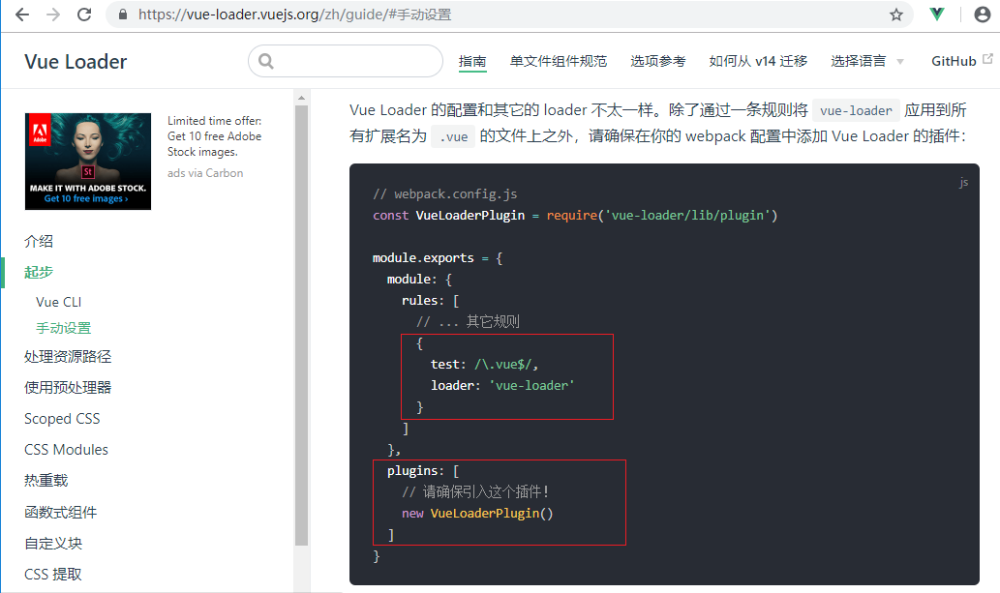

```javascript
// webpack.config.js
const VueLoaderPlugin = require('vue-loader/lib/plugin')

module.exports = {
  module: {
    rules: [
      // ... 其它规则
      {
        test: /\.vue$/,
        loader: 'vue-loader'
      }
    ]
  },
  plugins: [
    // 请确保引入这个插件！
    new VueLoaderPlugin()
  ]
}
```

> webpack配置文件修改后都需要重启服务

> rules:使得vue文件可以被vue-loader处理
>
> VueLoaderPlugin：使得各种loader也能针对vue单文件组件内容起作用，例如style-loader处理css内容、less-loader处理less内容、url-loader处理图片内容、babel-loader处理es6/es7内容等


### 应用

#### 私有组件

如果一个组件只需要在当前Vue实例中被使用，就声明为**私有**的

1. 定义组件内容(`src/components/xxx.vue`)

```html
<template>
	xxx
</template>
<script>
  export default {
		xxx
  }
</script>
<style lang="less">
	xxx
</style>
```


2. 主入口文件(`src/index.js`)导入组件模块，并注册为**私有**组件

```javascript
import XXX from './components/xxx.vue' 
var vm = new Vue({
  components:{
    // 名称: 组件
    'com-xxx': XXX
  }
})
```

> Vue实例内部有components成员，可以注册私有组件


3. 在模板文件(`src/index.html`)中使用组件

```html
<div id="app">
  <com-xxx></com-xxx>
</div>
```


#### 全局组件

如果一个组件需要在当前Vue的许多实例中被应用，就声明为全局的


主入口文件(`src/index.js`)导入组件模块，并注册为**全局**组件

```javascript
import XXX from './components/xxx.vue' 
// Vue.component(名称, 组件)
Vue.component('com-xxx',XXX)
```

> Vue本身有component成员方法，可以注册全局组件


#### scoped属性

默认情况下，vue单文件组件的style样式是[全局的]()，

如果在一个应用中使用了**多个**单文件组件，它们使用<span style="background-color:yellow;">相同选择器</span>为相同的元素设置了style样式，那么只有一个会起作用(后者会覆盖前者)

解决方法：

给每个style标签都设置一个`scoped`属性，这样各个单文件组件的html标签解析出来后都会带有一个与其他单组件标签不同的`data-v-xxx`的唯一属性，style样式设定也会自动与本身组件的`data-v-xxx`联系起来，这样就使得style样式只针对自己的组件起作用了

设置：

```html
<style  scoped>
  xxxxx
</style>
```


注意：

尽管有scoped，但是不同的组件间还是尽量**不要使用相同名称**的选择器


### 组件嵌套

多个组件根据业务需要可以一并使用，它们之间可以形成平级关系 也 可以形成嵌套关系，

下边就讲解下组件**嵌套**的实现


index.html主模板文件------(包括)------->父组件-------(包括)--------->子组件


1. 定义两个组件(`src/components/Fat.vue` 和 `src/components/Son.vue`)

   Son.vue内容

   ```html
   <template>
     <div>
       <p>我是son子级组件</p>
     </div>
   </template>
   <script>
   </script>
   <style lang="less" scoped>
   </style>
   ```

   Fat.vue内容(注册子组件 并 使用)

   ```html
   <template>
     <div>
       <p>我是fat父级组件</p>
       <my-son></my-son>
     </div>
   </template>
   <script>
     // 引入son子级组件模块
     import MySon from './Son.vue'
     
     export default {
       // 进行私有组件注册，只能声明为私有组件
       components:{
         'my-son': MySon
       }
     }
   </script>
   <style lang="less" scoped>
   </style>
   ```

2. 在入口文件src/index.js中**引入并注册**父组件

   ```javascript
   import ComFat from './components/Fat.vue' 
   var vm = new Vue({
     components:{
       'com-fat': ComFat
     }
   })
   ```

3. 在主模板中使用父组件

   ```html
   <div id="app">
     <com-fat></com-fat>
   </div>
   ```

> index.html----------->fat.vue------------>son.vue


注意：

​	父组件 与 子组件 形成嵌套关系，它们的style样式要避免使用相同的选择器


### 工欲善其事必先利其器

给vscode编辑器安装两个扩展，使得代码的编辑更加**快速**和**高效**


1. Vetur：

   支持 vue 文件的代码语法高亮、代码格式化等

   ```
   "vetur.format.options.tabSize": 2,
   ```

2. Vue 2 Snippets：

   给vue文件做代码片段的配置，使得代码片段的文件类型增加上**vue**

   

   

   内容参考如下：

   ```javascript
   {
     "Create vue template": {
       "prefix": "vuec",
       "body": [
        "<template>",
        "    <div>$1</div>",
        "</template>",
        "",
        "<script>",
        "export default {",
        "}",
        "</script>",
        "",
        "<style lang=\"less\" scoped>",
        "</style>",
        "",
       ],
       "description": "Create vue template"
     }
   }
   ```

   > 现在就可以在vue单文件组件中通过`vuec`代码片段把一个组件的主结构内容给绘制出来


### 父子组件传递数据

父子组件之间通信也是常见操作，例如一个button按钮组件，给其传递参数，可以决定该按钮以什么样式进行显示


> 自行把父、子嵌套结构制作好


1. 父组件中(Fat.vue)通过“`属性`”给子组件传递数据

   ```html
   <com-button size="25px" bgcolor="blue"></com-button>
   <com-button size="20px" bgcolor="green"></com-button>
   ```

   > 给com-button组件传递两个数据 size 和 bgcolor
   >
   > 父组件给子组件传递的数据既可以是 “普通数据” 也可以是 “组件数据(属性绑定)”

2. 子组件中(Son.vue)通过props对父组件 传递的数据进行接收

   ```html
   <script>
     export default {
       props: ['size', 'bgcolor']
     }
   </script>
   ```

3. 子组件(Son.vue)使用 父组件 传递来的数据

   ```html
   <template>
     <div>
       <button :style="{'font-size':size,'background-color':bgcolor}">我是按钮</button>
     </div>
   </template>
   ```

### 小结

1. vue单文件组件相比普通组件更加**专业**、优势更明显

2. vue单文件组件有**三部分**组成(template/script/style)

3. vue单文件组件需要通过**vue-loader**解析处理(类似less文件需要有less-loader处理)

4. vue单文件组件可以通过component声明为**全局**组件  或 components声明为**私有**组件

5. 两个组件可以形成**父子**的嵌套关系

6. 由于业务需要，组件间需要**传递**数据

   父给子：属性值、props


## vue生命周期

### render函数渲染

在Vue中如果定义了render成员，那么其提供的内容会渲染到页面中，并且会覆盖原容器，

其优先级最高，高于template和el

语法：

```javascript
var vm = new Vue({
  el:'#app',  // 挂载容器
  render(create){
    // create参数是函数，并且可以创建容器要显示的内容
    // create(标签名称, 标签内容区域的信息)
    return create('p', '今天天气很好，心情很好')
  }
})
```

### 什么是生命周期

辅助参考：

<https://segmentfault.com/a/1190000011381906>


定义：生命周期是指vue实例(或者组件)从诞生到消亡所经历的各个阶段的总和，这些阶段可以调用**函数**感知到


生命周期：

vue在使用的过程中，分为多个阶段，具体有[创建]()、[运行]()、[销毁]()

- 创建阶段由空白期、data初始化、methods初始化、模板渲染等组成
- 运行阶段分为 更新前 和 更新后 两部分
- 销毁阶段分为 销毁前 和 销毁后

不同阶段完成不同的任务，开发者可以利用各个阶段的特点完成业务需要的相关功能


[生命周期参考](https://vue.docschina.org/v2/guide/instance.html#%E7%94%9F%E5%91%BD%E5%91%A8%E6%9C%9F%E7%A4%BA%E6%84%8F%E5%9B%BE)

### 生命周期函数分类

#### 创建阶段

- 创建期间的生命周期函数：(特点：每个实例一辈子只执行一次，并且是自动的)

  - [beforeCreate]()：创建之前，此时 data 和 methods 尚未初始化

  - **[created]()** : <font color=red>第一个重要</font>的函数，此时，data 和 methods 已经创建好了，可以被访问，在此处非常适合做`data`数据初始化操作

  - [beforeMount]()：挂载容器模板结构之前，此时，容器的内容已经被Vue获取到了(容器本身还是未解析的原始内容)；

    现在Vue实例就被称为 **Virtual DOM(虚拟DOM)**

    

    

  - **[mounted]()** <font color=red>第二个重要</font>的函数，此时，容器被vue渲染解析完毕；是操作初始**DOM**元素的最好时机

  - 

    ```javascript
    beforeCreate() {
      console.group('---------beforeCreate调用--------')
      console.log('%c%s', 'color:red', 'el现在的样子：' + this.$el)   // undefined
      console.log('%c%s', 'color:red', 'data现在的样子：' + this.$data)  // undefined
      console.log('%c%s', 'color:red', 'methods方法现在的样子：' + this.getInfo) // undefined
    }
    ```

    > console.group() 按照组别对调试信息进行划分
    >
    > %c: 给调试信息设置样式，通过log的第2个参数体现
    >
    > $s: 通过string字符串方式输出信息，通过log的第3个参数体现
    >
    > this.$el:  获得到与Vue实例关联的容器
    >
    > this.$data: 获得data全部的成员，以对象形式返回
    >
    > this.getInfo: 把methods成员方法当做普通变量获取输出

    

    ```js
    created() {
      console.group('---------created调用--------')
      console.log('%c%s', 'color:red', 'el现在的样子：' + this.$el)    // undefined
      console.log('%c%s', 'color:red', 'data现在的样子：' + this.$data)  // 实体
      console.log('%c%s', 'color:red', 'methods方法：' + this.getDate) 	// 实体
    }
    ```

    > 在此函数中适合进行Vue数据初始化(获取首屏数据)操作

    ```js
    beforeMount() {
      console.group('---------beforeMount调用--------')
      console.log('%c%s', 'color:red', 'el现在的样子：' + this.$el) // 实体
      console.log(this.$el) // 编译【前】的实体内容
    }
    ```

    ```js
    mounted() {
      console.group('---------mounted调用--------')   
      console.log('%c%s', 'color:red', 'el现在的样子：' + this.$el) // 实体
      console.log(this.$el) // 编译【后】的实体内容
    }
    ```

    > 此时适合对页面dom元素做初始化操作

  


#### 运行阶段

- 运行期间的生命周期函数：（特点：按需被调用 至少0次，最多不限制）

  - beforeUpdate：
    根据最新的数据重新解析渲染浏览器页面，此时  vue虚拟数据是最新的，但是页面还是旧的

  - updated：页面和数据都是最新的
    页面已经完成了更新，此时data数据和页面都是最新的

    ```
    beforeUpdate() {
      console.group('---------beforeUpdate调用--------')
      console.log(
        '%c%s',
        'color:red',
        'h2数据更新之前的效果：' + document.querySelector('h2').innerHTML
      )
    }
    ```

    ```
    updated() {
      console.group('---------updated调用--------')
      console.log(
        '%c%s',
        'color:red',
        'h2数据更新之后的效果：' + document.querySelector('h2').innerHTML
      )
    }
    ```

    

    有 <font color=red>"Virtual DOM(虚拟DOM)"</font>，其是Vue实例获取到的div容器，是虚拟的(不是页面实实在在看到的)，该VirtualDOM 在Vue的生命周期运行阶段始终存在，随时感知数据变化，随时同步给页面

#### 销毁阶段

- 销毁期间的生命周期函数：(特点：每个实例一辈子只执行一次)

  - beforeDestroy：将要销毁，处于销毁之前阶段，实例还正常可用

  - destroyed：销毁之后，Vue实例已经不工作了

    ```
    beforeDestroy() {
      console.group('---------beforeDestroy调用--------')
      console.log('%c%s', 'color:red', 'el现在的样子：' + this.$el)
    },
    
    ```

    ```
    destroyed() {
      console.group('---------destroyed调用--------')
      console.log('%c%s', 'color:red', 'el现在的样子：' + this.$el)
    }
    ```


完整应用示例：

```html
<!DOCTYPE html>
<html lang="en">
<head>
  <meta charset="UTF-8">
  <meta name="viewport" content="width=device-width, initial-scale=1.0">
  <meta http-equiv="X-UA-Compatible" content="ie=edge">
  <title>Document</title>
</head>
<body>
  <!--创建一个div容器，vue对该容器进行控制，设置要显示的内容-->
  <div id="app">
    <h2>{{ msg }}</h2>
  </div>
  
  <script src="./vue-2.6.10.js"></script>
  <script>
    var vm = new Vue({
      // 1) 生命周期创建阶段(4个函数),会自动执行
      beforeCreate(){
        // Vue实例已经创建完毕，但是相关的成员都没有，el、methods、data等等都没有
        console.group('--------beforeCreate发生调用--------')
        console.log('%c%s','color:red','el现在的样子：'+this.$el)     // undefined
        console.log('%c%s','color:red','data现在的样子：'+this.$data) // undefined
        console.log('%c%s','color:red','getDate现在的样子：'+this.getDate)  // undefined
      },
      created(){
        // 该阶段是一个【重要】阶段，此时data 和 methods已经准备好了，但是还没有去找div容器
        // 此阶段可以用于页面首屏数据获取操作，获取回来的数据存储给data的某个成员即可
        console.group('--------created发生调用--------')
        console.log('%c%s','color:red','el现在的样子：'+this.$el)      // undefined
        console.log('%c%s','color:red','data现在的样子：'+this.$data)  // 实体
        console.log('%c%s','color:red','getDate现在的样子：'+this.getDate)  // 实体
      },
      beforeMount(){
        // 此阶段完成了Vue实例对象 与 div容器联系的过程(本质是div容器已经被Vue实例获取到了)
        // 但是div容器的内容还是没有编译前的原生内容
        console.group('--------beforeMount发生调用--------')
        console.log('%c%s','color:red','el现在的样子：'+this.$el)      // 实体
        console.log(document.getElementsByTagName('h2')[0])  // 
      },
      mounted(){
        // 此阶段 Vue实例已经完成了div容器的内容的编译，并且编译好的内容也渲染给div容器了
        console.group('--------mounted发生调用--------')
        console.log('%c%s','color:red','el现在的样子：'+this.$el)      // 实体
        console.log(document.getElementsByTagName('h2')[0])  // 容器编译【后】实体内容
      },

      // 2) 生命周期运行阶段(2个函数),data数据变化后才会执行
      beforeUpdate() {
        console.group('---------beforeUpdate调用--------')
        console.log(
            '%c%s',
            'color:red',
            'h2数据更新【前】的效果：' + document.querySelector('h2').innerHTML
        )
      },
      updated() {
        console.group('---------updated调用--------')
        console.log(
          '%c%s',
          'color:red',
          'h2数据更新【后】的效果：' + document.querySelector('h2').innerHTML
        )
      },
      
      // 3) 生命周期销毁阶段(2个函数),只有vm调用$destroy()方法后才执行
      beforeDestroy() {
        console.group('---------beforeDestroy调用--------')
        console.log('%c%s', 'color:red', 'el现在的样子：' + this.$el)
      },
      destroyed() {
        console.group('---------destroyed调用--------')
        console.log('%c%s', 'color:red', 'el现在的样子：' + this.$el)
      },
      el: '#app',
      data: {
        msg: '生命周期学习篇'
      },
      methods: {
        getDate(){
          console.log('Sunday')
        }
      }
    })
  </script>
</body>
</html>
```


### 小结

生命周期创建阶段的**created**和**mounted**两个函数最经常使用，其他了解即可

created：一般用于页面首屏data数据初始化使用

mounted：可对渲染完毕的页面做dom初始化操作(例如给dom元素设置事件)


## 上传图片组件

```
<el-upload
  class="avatar-uploader"
  action="服务器端接收图片的地址"
  :headers="{ Authorization: token信息"
  :show-file-list="false"
  :on-success="handleAvatarSuccess"   // 文件上工回调处理
  :http-request="httpAvatarRequest"
>
  
  <i v-else class="el-icon-plus avatar-uploader-icon"></i>
</el-upload>
```

> action是必须属性
>
> headers  图片上传设置http头协议信息，例如token
>
> show-file-list  是否显示已经上传的图片
>
> on-success  图片上传成功回调处理
>
> http-request  覆盖默认的上传行为，可以自定义上传的实现
>
> img标签  用于显示上传好的图片效果
>
> i标签 用于显示默认上传图标效果


## 路由守卫

### 什么是

路由对象有一个名称为**beforeEach**的方法，每个路由在加载组件之前都要调用它，在这个方法中可以做逻辑判断，限制要做什么或不做什么，这个过程称为`路由守卫`，有着一夫当关万夫莫开的效果

案例应用场景：

​	用户访问项目系统，登录状态就让访问各个页面，否则跳转到登录页面去

​	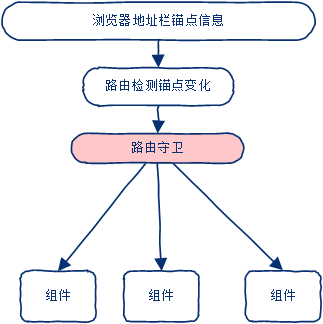


### 语法

```javascript
router.beforeEach((to, from, next) => { /* 导航守卫 处理逻辑 */ })
```

> 这里的 router 就是 new VueRouter 得到的 路由对象
>
> beforeEach()是路由在显示组件**之前**要执行的代码

参数1

- to:是一个对象，保存着将要访问路由相关的参数

- from:是一个对象，保存着离开的那个页面的相关路由参数

- next:是一个函数，对后续的执行起着 拦截 或 放行 的作用

  如果没有问题请**一定**执行next()方法，以进行后续操作，

  next()方法也可以通过传递路由信息实现其他组件的显示

  例如：next('/login')   显示登录组件


### scoped属性

默认情况下，vue单文件组件的style样式是[全局的]()，

如果在一个应用中使用了**多个**单文件组件，它们使用<span style="background-color:yellow;">相同选择器</span>为相同的元素设置了style样式，那么只有最后的起作用，前者会被覆盖

解决方法：

给每个style标签都设置一个`scoped`属性，这样各个单文件组件的html标签解析出来后都会带有一个与其他单组件标签不同的`data-v-xxx`的唯一属性，style样式设定也会自动与本身组件的`data-v-xxx`联系起来，这样就使得style样式只针对自己的组件起作用了

设置：

```html
<style  scoped>
  xxxxx
</style>
```


注意：

尽管有scoped，但是不同的组件间还是尽量**不要使用相同名称**的css样式选择器


# Vuex小试牛刀

## 什么是Vuex

Vuex 是一个专为 Vue.js 应用程序开发的**状态(数据)管理模式**。
它采用集中式存储管理应用的所有组件的**数据**

Vuex是实现组件之间<span style="background-color:yellow;">数据共享</span>的一种机制


[官网参考](https://vuex.vuejs.org/zh/)


## 为什么要有

父子、子父、兄弟传值 ，太麻烦了，不好维护

vuex提供了一种全新的数据共享管理模式，这可以使得系统中全部的组件共享同一份数据，彼此不用传递，

相比普通组件传值  vuex更加易用、高端。


注意：

- 只有组件间共享的数据，才有必要存储到vuex中，组件自己私有的数据，还是要存储到自己的data中；
- 在应用的时候要因地制宜，不要来了一个新技术就否定一个传统技术，大家都有所擅长，项目比较小的时候适合使用 组件传值，大中型项目适合使用vuex


## 简单使用

步骤：

1. 安装vuex

   ```bash
   yarn add vuex
   ```

   

2. 在src根目录创建store.js文件，在里边引入配置使用vuex

   ```js
   // 引入vue
   import Vue from 'vue'
   // 引入Vuex
   import Vuex from 'vuex'
   // vue注册vuex
   Vue.use(Vuex)
   // 实例化vue对象
   var store = new Vuex.Store({
     // 定义共享数据
     state: {
       addr: '北京'
     },
     mutations: {}
   })
   // 导出vuex对象
   export default store
   ```

3. 在main.js主入口文件引入并绑定vuex

   ```js
   // 引入vuex对象
   import store from './store'
   new Vue({
     // 把vuex对象绑定给Vue实例
     store,
   
   }).$mount('#app')
   ```

4. 现在在任意一个组件里边都可以访问vuex数据了

   ```html
   {{$store.state.addr}}
   ```


相关文章

1. [vue.js 2.x 官网-国内](https://vue.docschina.org/)   或  [vue.js2.X 官网-国外](http://cn.vuejs.org)
2. [npm](https://www.npmjs.com/)
3. [饿了么组件库](http://element-cn.eleme.io/#/zh-CN)
4. [github](https://github.com/)
5. [webpack打包](https://webpack.docschina.org/)
6. [babel下一代javascript编译器](https://babel.docschina.org/)
7. [bootcdn免费提供静态内容支持](https://www.bootcdn.cn/)
8. [w3c帮助官网](http://www.w3school.com.cn)
9. [鸟哥帮助官网](http://www.runoob.com)
10. [JavaScript 指南](https://developer.mozilla.org/zh-CN/docs/Web/JavaScript/Guide)
11. [印记中文(深入挖掘国外前端新领域，为中国 Web 前端开发人员提供优质文档！)](https://docschina.org/)
12. [js 里面的键盘事件对应的键码](http://www.cnblogs.com/wuhua1/p/6686237.html)
13. [Vue.js双向绑定的实现原理](http://www.cnblogs.com/kidney/p/6052935.html)
14. [Vue开源项目汇总](https://github.com/opendigg/awesome-github-vue)
15. [Vuejs中文社区](https://www.vue-js.com)
16. [JavaScript Standard Style代码规范](https://standardjs.com/)

